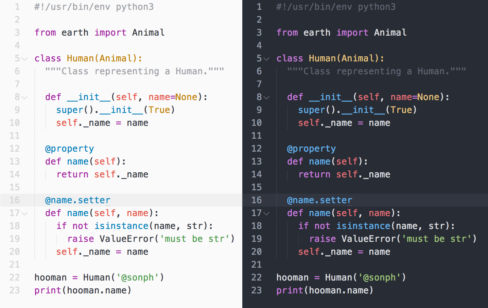

# One Half 🎨 🖥

A color scheme for Sublime Text, N/Vim, iTerm, and more. Based on Atom's One. Work in progress.

- Name: One Half
- Author: Son A. Pham [@sonph](http://github.com/sonph)
- Repo: https://github.com/sonph/onehalf
- License: MIT

**Table of Contents**

- [Features](#features)
- [Screenshots](#screenshots)
- [Installation & Usage](#installation-&-usage)
- [Contributing / Troubleshooting / Bug Reports](#contributing--troubleshooting--bug-reports)
- [License](#license)

## Features
- Light and dark color schemes
- Consistent colors across a wide variety of editors and terminals
  - [x] [TextMate](./sublimetext)
  - [x] [Sublime Text 2/3](./sublimetext)
  - [x] [GVim, MacVim, NeoVim, vim-airline (GUI/true colors)](./vim)
  - [x] [OS X Terminal.app](./terminal)
  - [x] [iTerm2](./iterm)
  - [x] [Terminal Vim, vim-airline (256 colors)](./vim)
  - [x] [Gnome Terminal](./gnome-terminal)
  - [ ] IntelliJ
  - [ ] Eclipse
  - [ ] GNU Emacs
  - [ ] Pygments
  - [ ] Prism
  - [add your suggestion](https://github.com/sonph/onehalf/issues/new)

## Screenshots
All screenshots are available in the [screenshots folder](./screenshots).

## Installation & Usage
### Vim
Install with Vundle then set `colorscheme` and `g:airline_theme`:

    Bundle 'sonph/onehalf', {'rtp': 'vim/'}
    colorscheme onehalflight
    let g:airline_theme='onehalfdark'

Or if you are using lightline, set `g:lightline.colorscheme`:

    let g:lightline.colorscheme='onehalfdark'

([details/manual installation](./vim/README.md))

### Sublime Text 2/3
Install with [Package Control](https://packagecontrol.io/packages/One%20Half%20Color%20Schemes).

([details/manual installation](./sublimetext/README.md))

### iTerm2
1. Download the theme files in the [iterm](./iterm) folder
2. Import the color schemes
  - _Either_ double click on the files to import
  - _Or_ open iTerm Preferences > Profiles > Colors > Color Presets > Import
  then select the downloaded files
3. Select Preferences > Profiles > Colors > Color Presets > One Half Light (Dark)

### OS X Terminal.app
Download the files in the [terminal](./terminal) folder and double click on a
color scheme file.

## Contributing / Troubleshooting / Bug Reports
Contributions are welcome. Feel free to [open an issue](https://github.com/sonph/onehalf/issues/new)
if you have problems installing and using the color schemes.

## License
Released under the MIT license.
