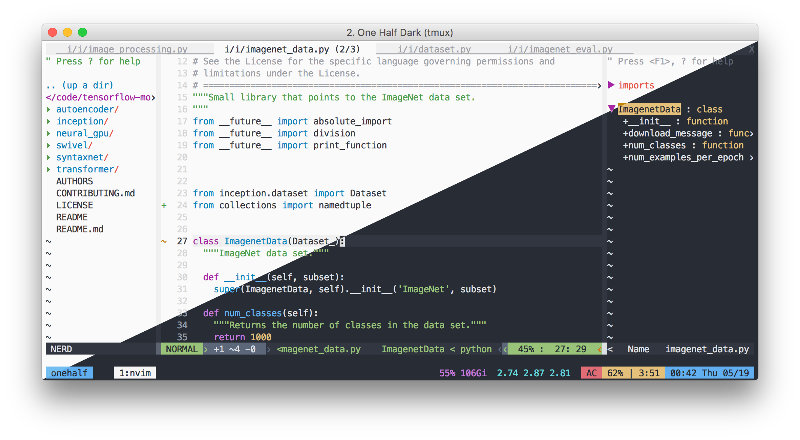
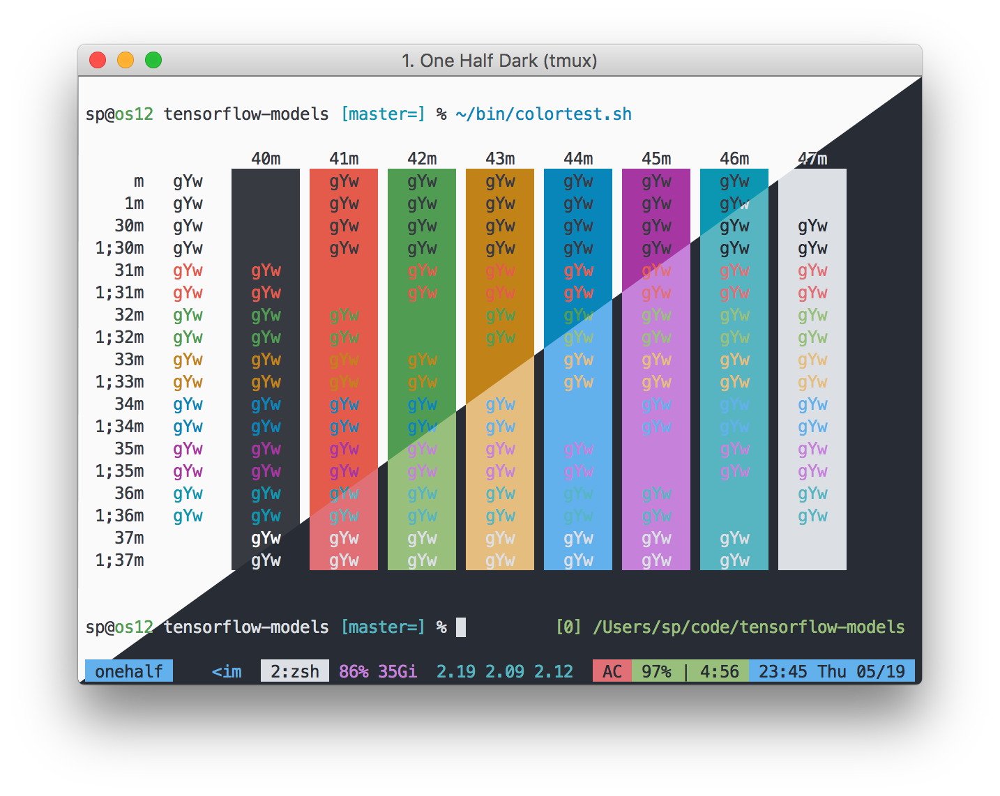

**Table of Contents**

- [One Half 🎨 🖥](#one-half-%F0%9F%8E%A8-%F0%9F%96%A5)
  - [Screenshots](#screenshots)
    - [Sublime Text](#sublime-text)
    - [(Neo)Vim](#neovim)
    - [iTerm](#iterm)
  - [Features](#features)
  - [Installation & Usage](#installation-&-usage)
  - [Contributing / Troubleshooting / Bug Reports](#contributing--troubleshooting--bug-reports)
  - [License](#license)

# One Half 🎨 🖥

A color scheme for Sublime Text, N/Vim, iTerm, and more. Based on Atom's One. Work in progress.

- Name: One Half
- Author: Son A. Pham [@sonph](http://github.com/sonph)
- Url: https://github.com/sonph/onehalf
- License: MIT

## Screenshots
(Individual screenshots are available in the [screenshots folder](./screenshots))

### Sublime Text
Sublime Text 3 with Menlo font and [Spacegray](https://github.com/kkga/spacegray) themes.

### (Neo)Vim
NeoVim + Tmux with true colors support on iTerm2.

### iTerm

## Features
WIP

## Installation & Usage
### Vim ([detailed instructions](./vim/README.md))
Install with Vundle and set `colorscheme` and `g:airline_theme`:

    Bundle 'sonph/onehalf', {'rtp': 'vim/'}
    colorscheme onehalflight
    let g:airline_theme='onehalfdark'

## Contributing / Troubleshooting / Bug Reports
Contributions are welcome. Feel free to [open an issue](https://github.com/sonph/onehalf/issues/new)
if you have problems installing and using the colorschemes.

## License
Released under the MIT license.