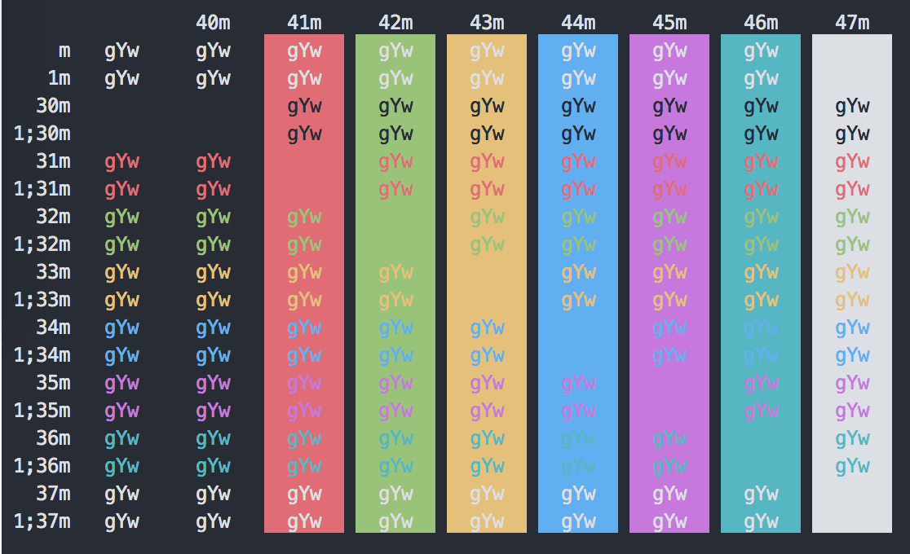
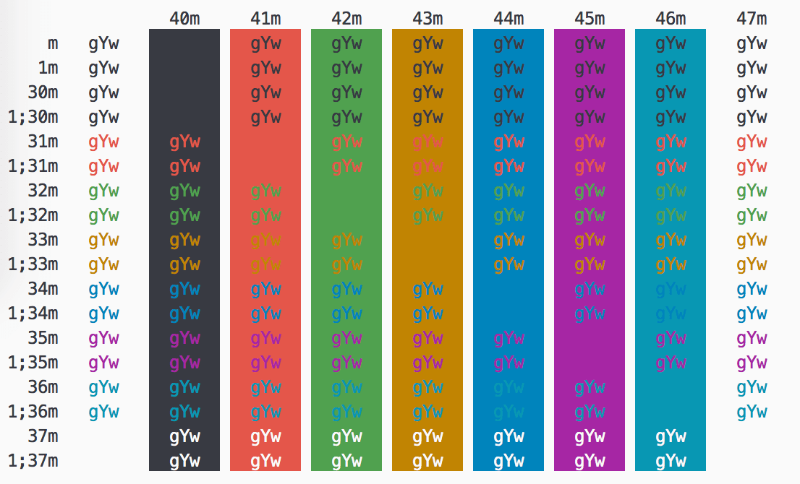
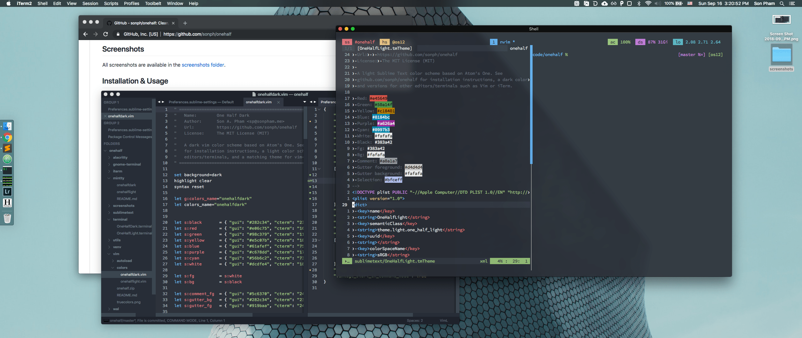
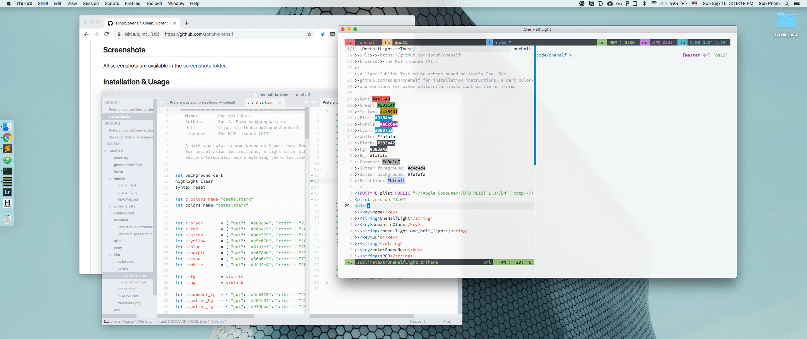

# One Half ½ 🎨 🖥

[](https://github.com/sonph/onehalf/releases)
[](https://github.com/sonph/onehalf/blob/master/LICENSE.txt)
[](https://packagecontrol.io/packages/One%20Half%20Color%20Schemes)

A color scheme for Sublime Text, (Neo)Vim, iTerm, and more. Based on Atom's One.

- Name: One Half
- Author: Son A. Pham [@sonph](http://github.com/sonph)
- Repo: https://github.com/sonph/onehalf
- License: MIT






**Table of Contents**

- [Features](#features)
- [Screenshots](#screenshots)
- [Installation & Usage](#installation--usage)
- [Contributing / Troubleshooting / Bug Reports](#contributing--troubleshooting--bug-reports)
- [License](LICENSE.txt)

## Features
- Light and dark color schemes.
- Support a wide range of editors and terminals for a consistent color theme.
  - [x] [Sublime Text 2/3](./sublimetext)
  - [x] [VSCode](./vscode)
  - [x] [GVim, MacVim, NeoVim, vim-airline (GUI/true colors)](./vim)
  - [x] [Terminal Vim, vim-airline (256 colors)](./vim)
  - [x] [iTerm2](./iterm)
  - [x] [Xcode](./xcode)
  - [x] [Windows Terminal](./windowsterminal)
  - [x] [OS X Terminal.app](./terminal)
  - [x] [Gnome Terminal](./gnome-terminal)
  - [x] [Konsole](./konsole)
  - [x] [Alacritty](./alacritty)
  - [x] [Mintty/WSLtty](./mintty)
  - [x] [FluentTerminal](./fluentterminal)
  - [x] [bat](https://github.com/sharkdp/bat)
  - [x] [pywal](https://github.com/dylanaraps/pywal)
  - [x] [PuTTY](./putty)
  - [x] [Kitty](./kitty)
  - [x] [TextMate](./sublimetext)
  - [x] [xfce4-terminal](./xfce4-terminal)
  - [ ] Hyper
  - [ ] ConEmu
  - [ ] IntelliJ
  - [ ] Eclipse
  - [ ] GNU Emacs
  - [ ] Pygments
  - [ ] Prism
  - [Add Your Suggestion](https://github.com/sonph/onehalf/issues/new)

```
                        light     dark
0   normal  black       #383a42   #282c34
1   normal  red         #e45649   #e06c75
2   normal  green       #50a14f   #98c379
3   normal  yellow      #c18401   #e5c07b
4   normal  blue        #0184bc   #61afef
5   normal  magenta     #a626a4   #c678dd
6   normal  cyan        #0997b3   #56b6c2
7   normal  white       #fafafa   #dcdfe4
            foreground  #383a42   #dcdfe4
            background  #fafafa   #282c34
```


## Screenshots
All screenshots are available in the [screenshots folder](./screenshots).

## Installation & Usage
### Vim
Install with [Vundle](https://github.com/VundleVim/Vundle.vim) then set `colorscheme` and `g:airline_theme`:

    Bundle 'sonph/onehalf', {'rtp': 'vim/'}
    colorscheme onehalflight
    let g:airline_theme='onehalfdark'

Or if you are using [lightline](https://github.com/itchyny/lightline.vim), set `g:lightline.colorscheme`:

    let g:lightline.colorscheme='onehalfdark'

If you want your vim and terminal colors to match exactly, you must enable true colors in vim.

For more details and manual installation, see [vim README](./vim/README.md).


### Sublime Text 2/3
Install with [Package Control](https://packagecontrol.io/packages/One%20Half%20Color%20Schemes).

For more details and manual installation, see [sublime text README](./sublimetext/README.md).


### iTerm2
1. Download the theme files in the [iterm](./iterm) folder.
2. Import the color schemes:
  - _Either_ double click on the files to import.
  - _Or_ open iTerm Preferences > Profiles > Colors > Color Presets > Import
  then select the downloaded files.
3. Select Preferences > Profiles > Colors > Color Presets > One Half Light (Dark).


### OS X Terminal.app
Download the files in the [terminal](./terminal) folder and simply open the files. Terminal.app will
automatically recognize and import the color schemes.

### Pywal
Copy the files in the [wal/colorschemes](./wal/colorschemes) folder under the matching
directories in `~/.config/wal/colorschemes`, then enable the schemes (`-l` is for light theme):

```
> wal -l --theme one-half-light
# or
> wal --theme one-half-dark
```

## Contributing / Troubleshooting / Bug Reports
Contributions are welcome. Feel free to [open an issue](https://github.com/sonph/onehalf/issues/new)
if you have problems installing and using the color schemes.
