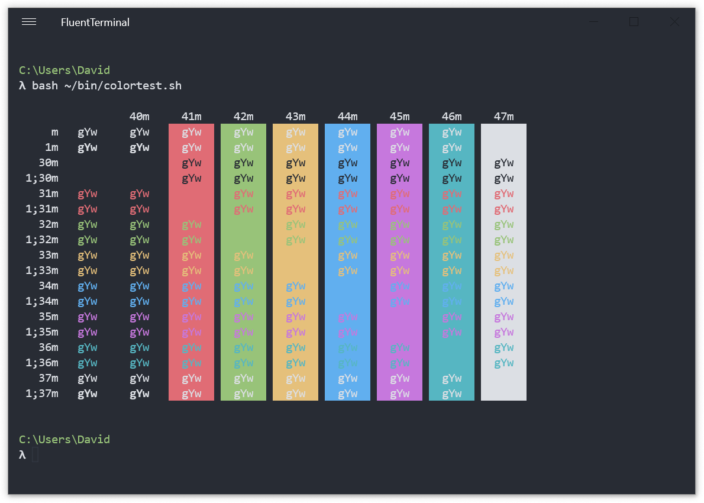
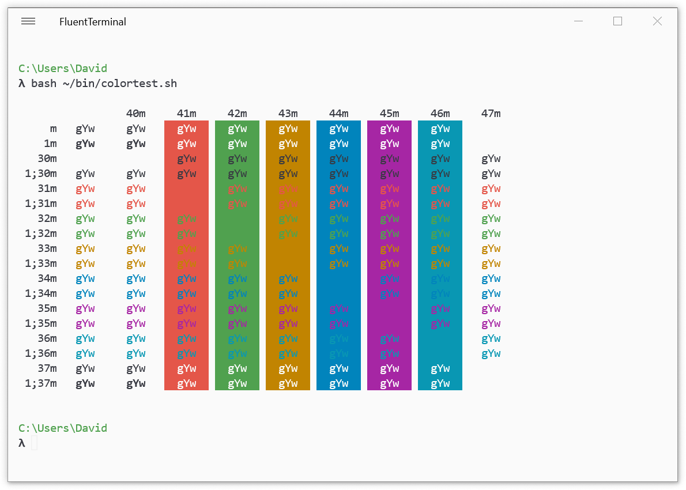

# FluentTerminal

[FluentTerminal](https://github.com/felixse/FluentTerminal) is a
terminal emulator based on UWP and web technologies.

## Screenshots



## Installation

Download the theme files:

```
wget https://raw.githubusercontent.com/sonph/onehalf/master/fluentterminal/OneHalfDark.flutecolors
wget https://raw.githubusercontent.com/sonph/onehalf/master/fluentterminal/OneHalfLight.flutecolors
```

Open FluentTerminal, go to Settings > Themes, click on "Import" and select OneHalfDark/OneHalfLight color files.

Then click on "Set Active" to activate each color scheme respectively.