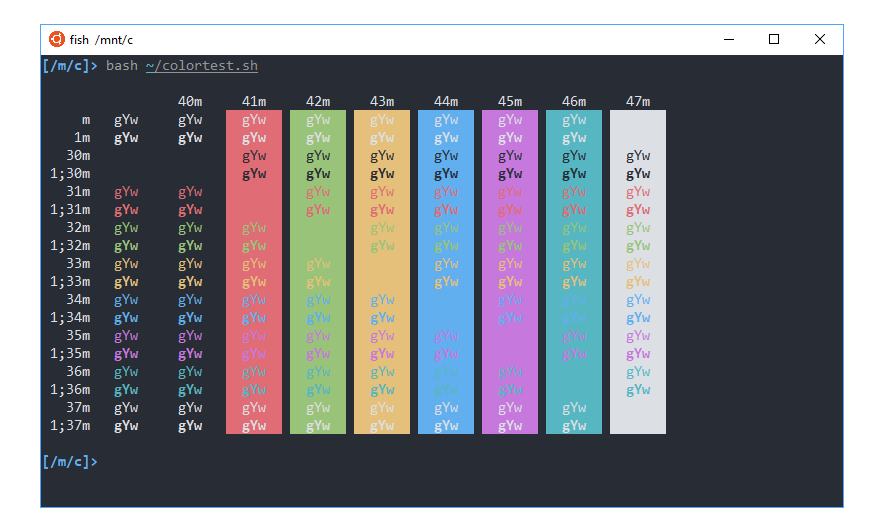
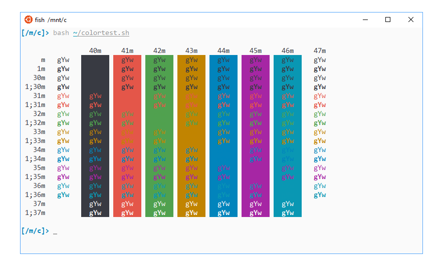

# Mintty/WSLtty

## Screenshots

## Installation

Download and move theme files `mintty\onehalf*` to `%APPDATA%\mintty\themes`. Replace `mintty` with `wsltty` for WSLtty.

Then open Mintty/WSLtty, select Options > Looks > Theme > onehalfdark/onehalflight.

