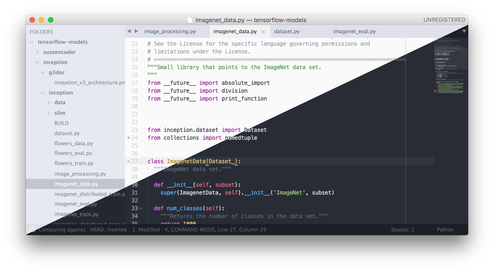

# Sublime Text Installation & Usage

Sublime Text 3 with Menlo font and [Spacegray](https://github.com/kkga/spacegray) themes.

## Installation
### Using package control (recommended)
__TL;DR__: Install with Sublime Text [Package Control](https://packagecontrol.io/packages/One%20Half%20Color%20Schemes)

1. Install [Sublime Text Package Control](https://packagecontrol.io/installation) if you do not already have it.

2. Open the command dropdown with `⌘ + Shift + P` (Mac) or `Ctrl + Shift + P` (Windows/Linux).

3. Search for and select "Package Control: Install Package".

4. Search for and select "One Half Color Schemes" to install.

### Manual Installation
1. In Sublime Text, click on Preferences, then Browse Packages.

2. Download the tmTheme files into `Packages/User`.

## Usage
Select the One Half Light (or Dark) color scheme in the Preferences menu.

## Troubleshooting/questions
Feel free to [open a new issue](https://github.com/sonph/onehalf/issues/new)
if you have questions or trouble getting it to work.