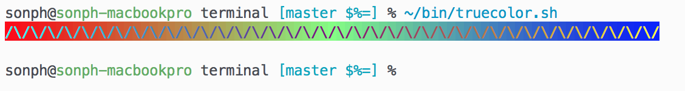

# Vim Installation & Usage

## Installation
### Using a plugin manager (recommended)

Use [Pathogen](http://github.com/tpope/vim-pathogen),
[Vundle](http://github.com/gmarik/vundle),
[Neobundle](http://github.com/Shougo/neobundle.vim) or your favourite Vim
package manager.

To install with Vundle, put

    Bundle 'sonph/onehalf', {'rtp': 'vim/'}

in your `.vimrc`, restart vim then execute `:PluginInstall`. This will install
both the color schemes and vim-airline themes.

### Manual Installation
Download the files in [vim/](./vim/) and put them in their respective folders
(`./vim/colors/` and `./vim/autoload/airline/themes/`)

## Usage
Put `colorscheme <scheme>` and `let g:airline_theme='<theme>'` in your `.vimrc`
to set the color scheme and airline theme. Make sure you have syntax
highlighting on, and 256 colors set. Vim version >= 7.4 recommended.

For example:

    syntax on
    set t_Co=256
    set cursorline
    colorscheme onehalflight
    let g:airline_theme='onehalfdark'

If you want to use true colors in terminal vim like in the screenshots, try
_nvim_ (with `let $NVIM_TUI_ENABLE_TRUE_COLOR=1` option) and a terminal emulator
with true color support such as _iTerm2_. For _tmux_ use version 2.2 or newer.
You can use
[this script](https://github.com/sonph/dotfiles/blob/master/bin/truecolor.sh)
to test if your terminal/tmux supports true colors or not.

## Troubleshooting/questions
Feel free to [open a new issue](https://github.com/sonph/onehalf/issues/new)
if you have questions or trouble getting it to work.