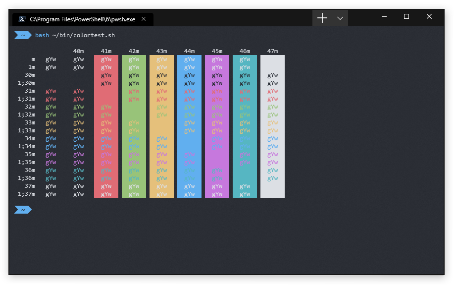
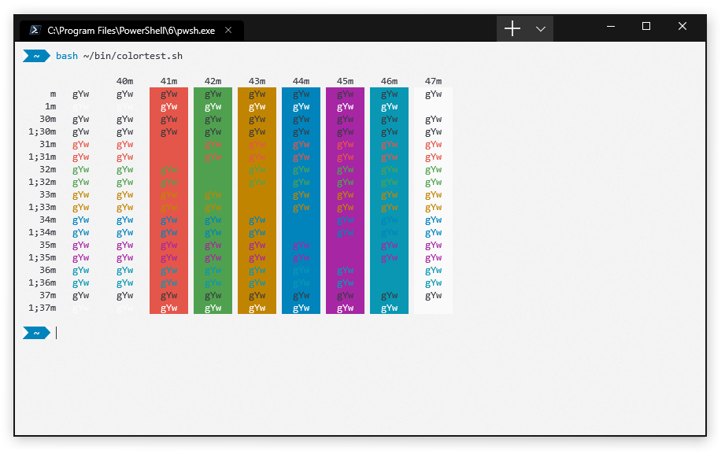

# Windows Terminal Installation & Usage

Windows Terminal with Consolas.

## Installation
### Manual Installation
1. Open the Windows Terminal and open the settings file.
	- Alternatively, you can open `%localappdata%\Packages\Microsoft.WindowsTerminal_8wekyb3d8bbwe\RoamingState\profiles.json` in your editor of choice.
2. Copy `OneHalf.json`, `OneHalfDark.json`, or `OneHalfLight.json` into your clipboard.
	- `OneHalf.json` contains both themes for your convenience.
3. Paste contents of clipboard into `profiles.json`, under `schemes`.

## Usage
Select the One Half Light (or Dark) color scheme in the profiles section in `profiles.json`.