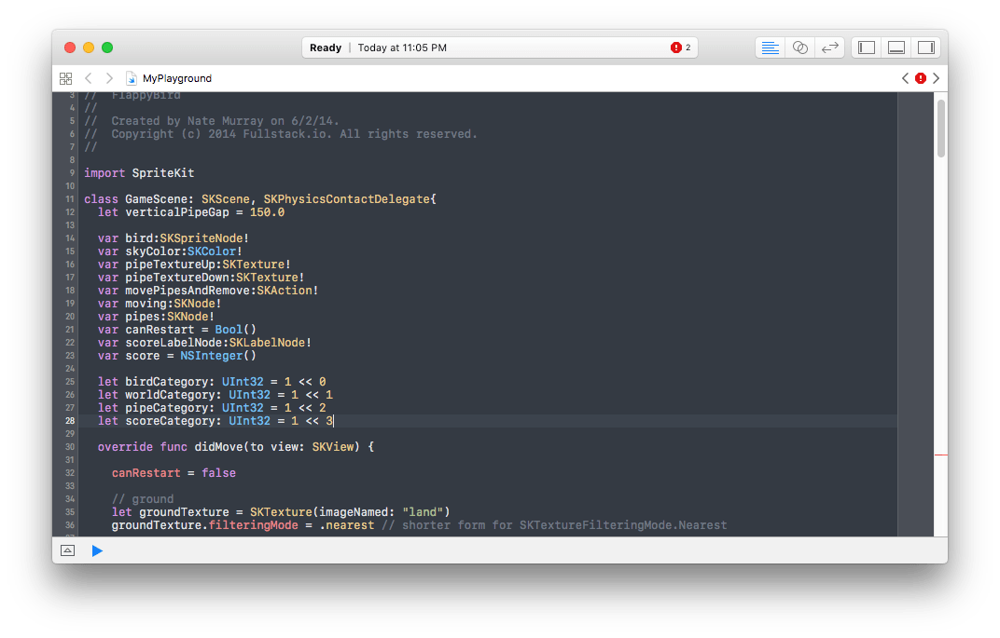
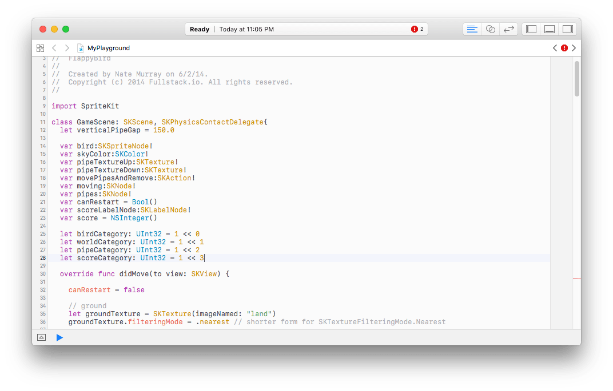

# Xcode

## Screenshots



## Installation

Download and move the theme files:

```
wget https://raw.githubusercontent.com/sonph/onehalf/master/xcode/OneHalfDark.dvtcolortheme
wget https://raw.githubusercontent.com/sonph/onehalf/master/xcode/OneHalfLight.dvtcolortheme
mkdir -p ~/Library/Developer/Xcode/UserData/FontAndColorThemes/
cp *.dvtcolortheme ~/Library/Developer/Xcode/UserData/FontAndColorThemes/
```

then restart/open Xcode, select Preferences > Fonts & Colors > OneHalfDark/OneHalfLight.
